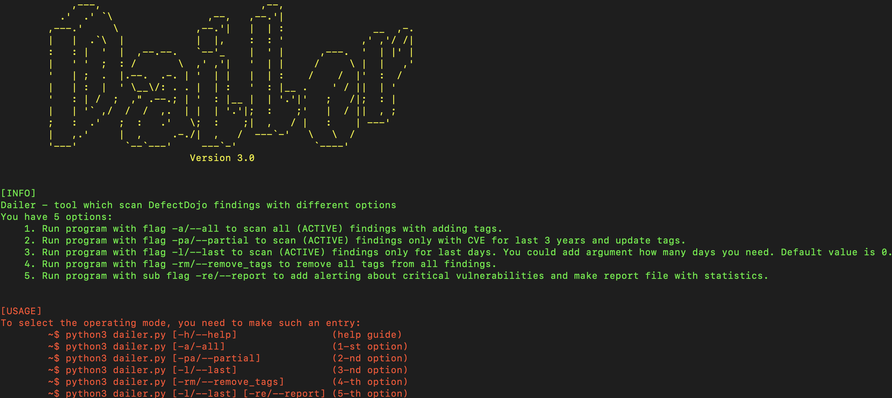

# Dailer framework

<div style="text-align: center;">
      
</div>

[](https://www.python.org/downloads/)

**Структура** 📄

[[_TOC_]]

# Description
**Dailer - это фреймворк, который сканирует файндинги в DefectDojo в нескольких режимах и выполняет определенные действия. Сканирование производится с помошью API DefectDojo.** 

**Основной функйционал - это добавление тегов в файндинги для ведения учета уязвимсотей**



## Режимы работы ♨️
```console
usage: Dailer [-h] [-a] [-pa] [-l [LAST]] [-rm] {report} ...

Vulnerability management framework DefectDojo

positional arguments:
  {report}              Add sub flag to extra working
    report              Add report about critical vulnerabilities

options:
  -h, --help            show this help message and exit
  -a, --all             Scan all active findings and add tags
  -pa, --partial        Scan findings only with CVE for last 3 years and update tags
  -l [LAST], --last [LAST]
                        Scan findings for last days, If you use --last without argument the default value is 0 (today)
  -rm, --remove_tags    Remove all tags from findings

```
**Пример запуска фреймворка:**
```console
$ python3 dailer.py --last 3 report 
// Фреймворк сканирует файндинги за последние 3 дня с флагом [--last] и сабфлаг {report} позволяет отправить отчет о работе в Rocket.chat.
```
**О режимах работы:**

Фреймворк сканирует все (Активные) файндинги которые есть на DefectDojo;
  1. Флаг [--all], добавляет к ним теги.
  2. Флаг [--partial], проверяет только CVE за последние 3 года и добавляет к ним теги.
  3. Флаг [--last + (arg)], сравнивает даты которые генерируются по флагу [--last] и (arg) и при соответсвии добавляет теги, (arg это число последних дней от текущей даты запуска фреймворка). 
  4. Флаг [--remove_tags], удаляет все теги.

**Была найдена проблема с API DefectDojo. API не принимает параметры запроса, поэтому время работы программы увеличивается экспоненциально кол-ву файндингов на DefectDojo.**

- [x] **Bug report** был направлен разработчикам - https://github.com/DefectDojo/django-DefectDojo/issues/8592

## О тегах 🏷️
**Теги добавляются на основе информации о CVE в каждом файндинге.**
  - [x] Информация из БД NVD. Добавляются теги по параметрам: exploitabilityScore, impactScore, attackVector, baseSeverity, attackComplexity. Параметры соотвествуют роли метрификации CVSSV(3.0/3.1)
  - [x] Информация из БД CISA. Добавляется тег "cisa" при условии что СVE было найдено в базе данных.
  - [x] Информация из БД EPSS. Добавляется тег "epss_(critical/high/medium/low)".
  - [x] Информация из БД exploit-db. Добавляется тег "exploit-db" при условии что СVE было найдено в базе данных.

**Пул возможных тегов:**

    1. {AccessVector} - av_n - значение NETWORK; av_l - значение LOCAL; av_a - значение Adjacent; av_p - значение Physical;
    2. {AttackComplexity} - ac_l - значение Low; ac_h - значение High;
    3. {BaseSeverity} - base_none; base_low; base_medium; base_high; base_critical;
    4. {ImpactScore} -  impact_none; impact_low; impact_medium; impact_high; impact_critical;
    5. {ExploitabilityScore} - exploitability_none; exploitability_low; exploitability_medium; exploitability_high; exploitability_critical;
    6. {Exploit-db} - exploit-db;
    7. {CISA} - cisa;
    8. {EPSS} - epss_low; epss_medium; epss_high; epss_critical;

# Конфигурация фреймворка🔧

**Конфигурация задается в файле .env**

Необходимо добавить credentials в основные поля

* URL= < DefectDojo simple path to findings >
* Token= < DefectDojo API token >
* Web_Hook_Alert = < WEB Hook path to send alert message>
* Web_Hook_Debug = < WEB Hook path to send debug message about problems of framework work >
* NIST_API_KEY = < NIST API KEY >
* NIST_URL = https://services.nvd.nist.gov/rest/json/cves/2.0?cveId=
* Cisa_URL = https://www.cisa.gov/sites/default/files/feeds/known_exploited_vulnerabilities.json
* EPSS_URL = https://api.first.org/data/v1/epss?cve=

## Функицонал и этапы работы: 
При иннумирации каждого файдинга, фреймворк делает:
  
1. Проверку флагов и сабфлага для корректной выборки и работы режима обработки.
2. Поиск CVE в файндинге. Поиск по полю [vulnerability_ids] при отсутвии CVE, поиск по полям [title], [description], [references] c помощью ругулярного выражения.
3. Поиск информации о CVE в NVD NIST и добавление тегов.
4. Поиск информации о CVE в базе данных Exploit-db и добавление тега.
5. Поиск инфомрации о CVE d базе данных CISA и добавление тега.
6. Поиск инфомрации о CVE d базе данных EPSS и добавление тега.
7. Обновление тегов в файндинге.
8. Запись сообщения о критической уязвимости в файл "logs/alert_list" при выполнение локальных условий.

**После иннумирации, фреймворк проверяет условие наличия сабфлага {report} и при его наличии читает "logs/logfile.log" + собирает общую статистику и отправляет сообщение в канал infosec в Rocket.chat. Далее идет чтение файла "logs/alert_list" и отравляется сообщение о критических уязвимостях в канал infosec_critical в Rocket.chat**

## Uml-диаграмма последовательности работы фреймворка

**Код диаграммы задан в файле app/uml/processes.puml**


# Docker- образ
1.  Build
    ```console
    docker build -t expdd .
    ```
2. Запуск образа "expdd"
    ```console
    docker run expdd
    ```


